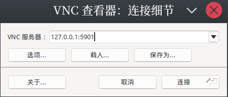
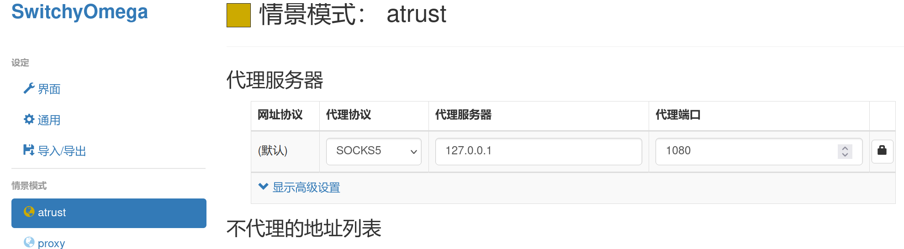

本项目来自于[docker-easyconnect](https://github.com/docker-easyconnect/docker-easyconnect)，这里只是做了一个启动脚本和关闭脚本，没有额外工作。

使用方法：

运行`start.sh`开启atrust

运行`stop.sh`关闭atrust

开启后使用`VNC`工具连接就可以看到图形界面了，如`tigervnc`，端口`5091`，密码`xxxx`（可在`start.sh`中更改）：

登陆后使用`SwitchyOmega`或其他代理切换插件配置`SOCKS5`代理为`1080`端口，对于`APIFox`这些需要`http`代理的使用`8888`端口：

